

<!-- ============ HERO — GLASS BANNER ============ -->
<!-- Asset: assets/hero_banner.svg -->
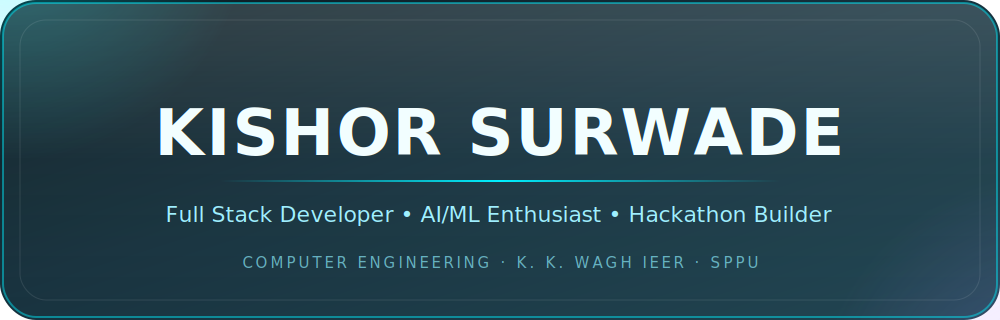

  

  

  

 

<!-- ============ ABOUT ============ -->

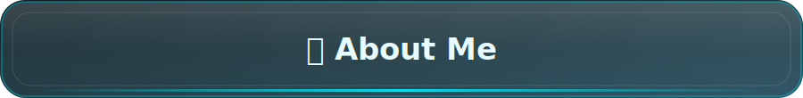

 

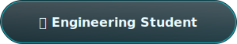  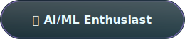

  

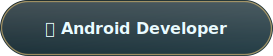  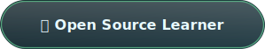

  

  

 

<!-- ============ FEATURED PROJECTS ============ -->

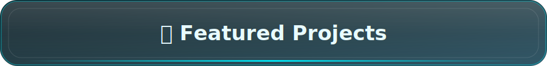

 

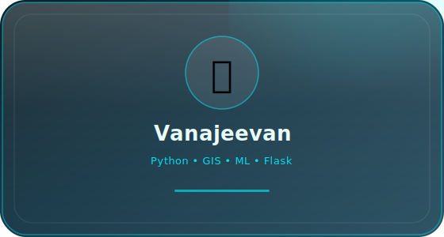 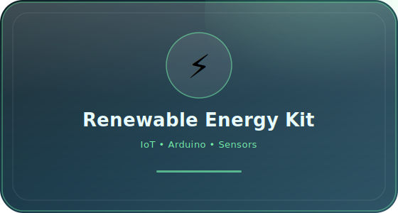

  

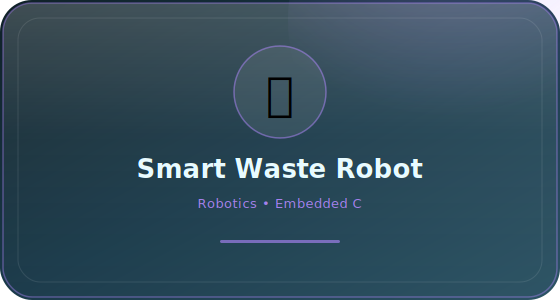 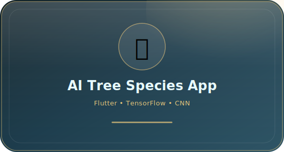

 

> 📁 **To use your own project screenshots:** keep the glass-card SVGs as the frame, or replace any card image with your own screenshot saved at the same path — e.g. swap `assets/card_vanajeevan.svg` for `assets/vanajeevan-screenshot.png` once you have a real dashboard/map capture.

 

<!-- ============ TECH ARSENAL ============ -->

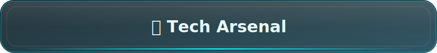

 

 

<!-- ============ GITHUB ANALYTICS ============ -->

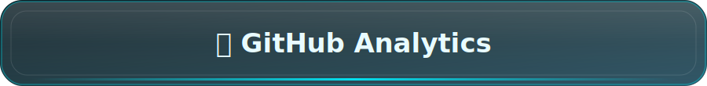

 

 

  

 

> ⚠️ **Stats showing blank or "Error"?** This is almost always one of these — in order of likelihood:
>
> **1. The special profile repo doesn't exist yet.** GitHub only renders this README as your profile page — and these stat cards only pull real data — if you have a **public repo named exactly `Kishores57/Kishores57`** with this file saved as its `README.md`. If that repo isn't created yet, create it first; this is the #1 cause of "stats not working."
>
> **2. Public stat servers are rate-limited.** `github-readme-stats.vercel.app` is a shared free instance that gets overloaded — this is a widely reported, known issue, not something broken in your file. Just reload the page first.
>
> **3. Self-host your own instance (permanent fix, ~2 min):** fork [anuraghazra/github-readme-stats](https://github.com/anuraghazra/github-readme-stats) → deploy to your own Vercel account (free) → swap the domain in your image URLs for your own `.vercel.app` link. This removes you from the shared rate limit entirely.
>
> **4. Username typo.** Every URL above must read exactly `username=Kishores57` — double-check capitalization matches your GitHub profile exactly.

 

<!-- ============ CONTRIBUTION SNAKE ============ -->

> ⚙️ Needs a one-time GitHub Action ([`platane/snk`](https://github.com/Platane/snk)) added to `.github/workflows/snake.yml` in your **`Kishores57/Kishores57`** repo to generate from your real contribution graph.

 

<!-- ============ ACHIEVEMENT ZONE ============ -->

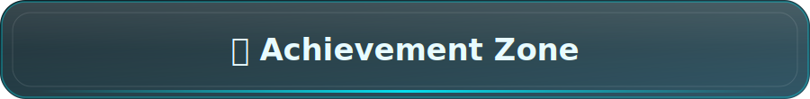

 

  

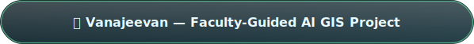

  

  

 

<!-- ============ CURRENT MISSION ============ -->

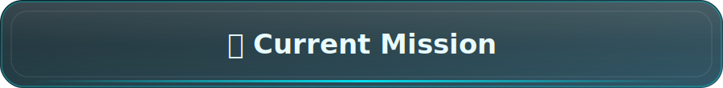

 

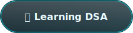 

  

 

 

<!-- ============ CONNECT ============ -->

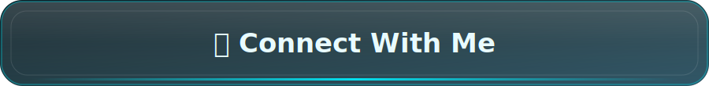

 

  

